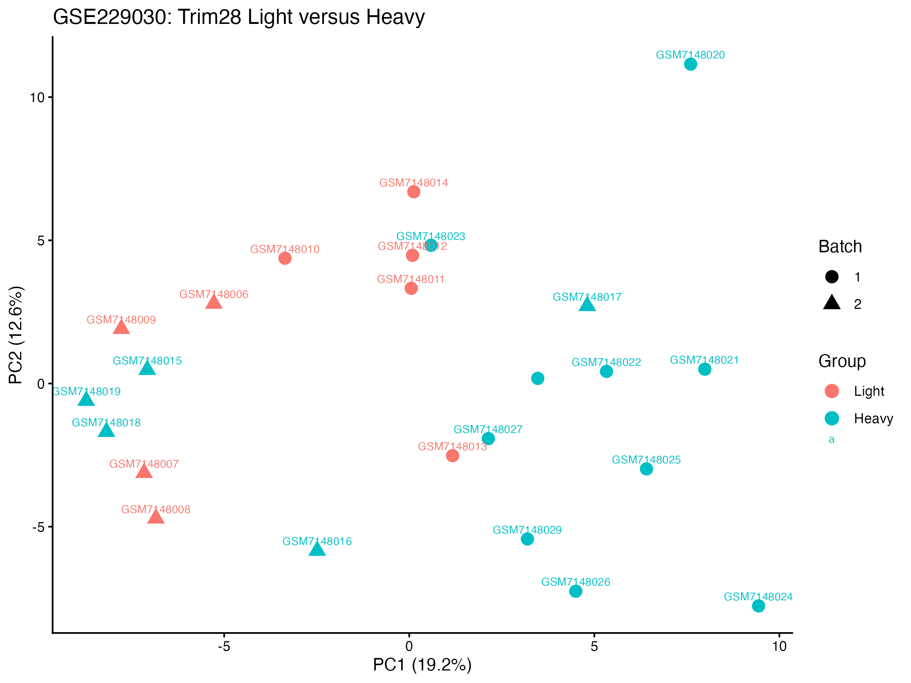
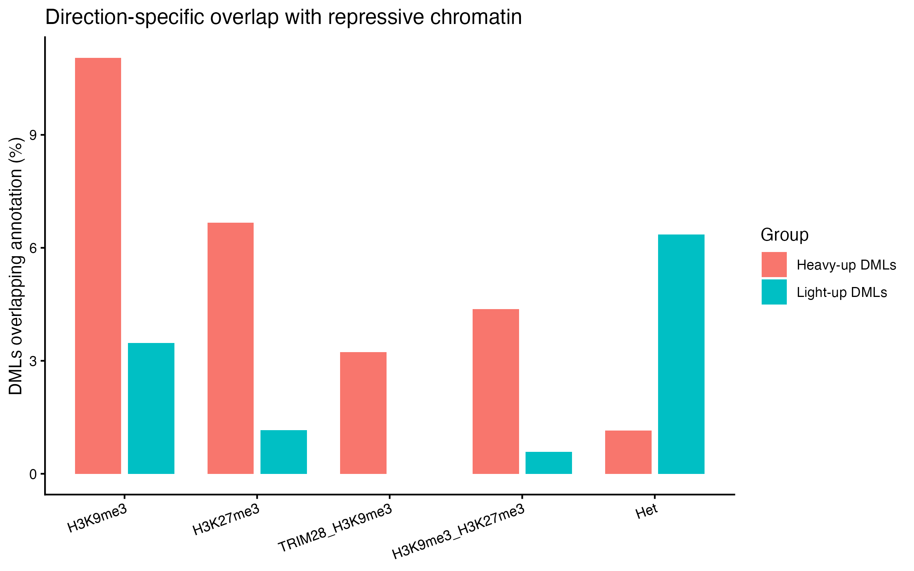
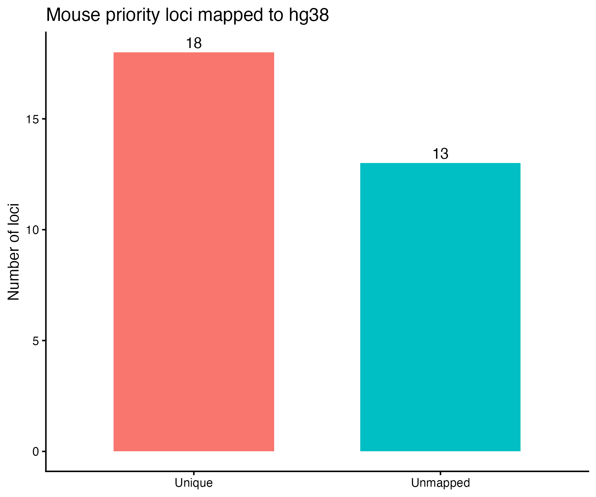
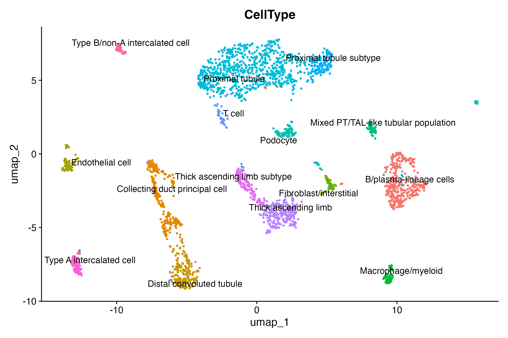
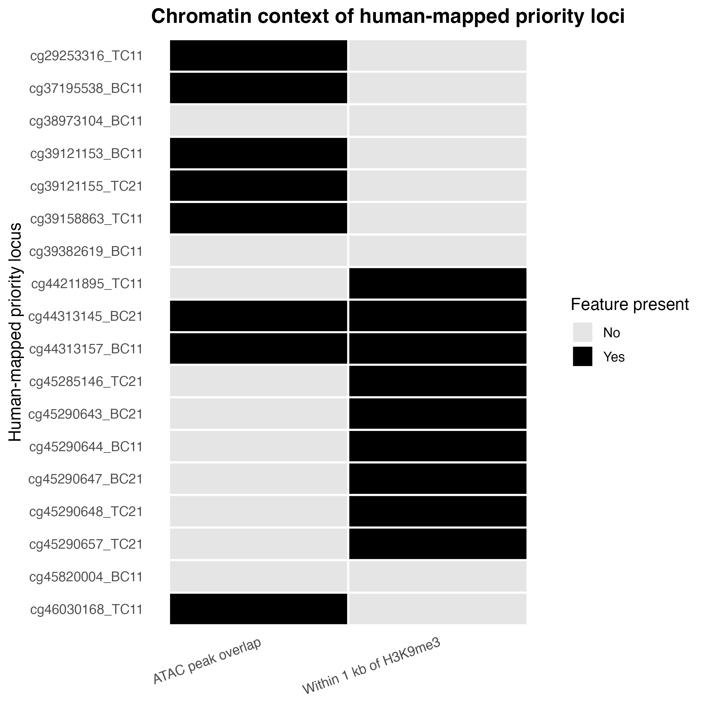
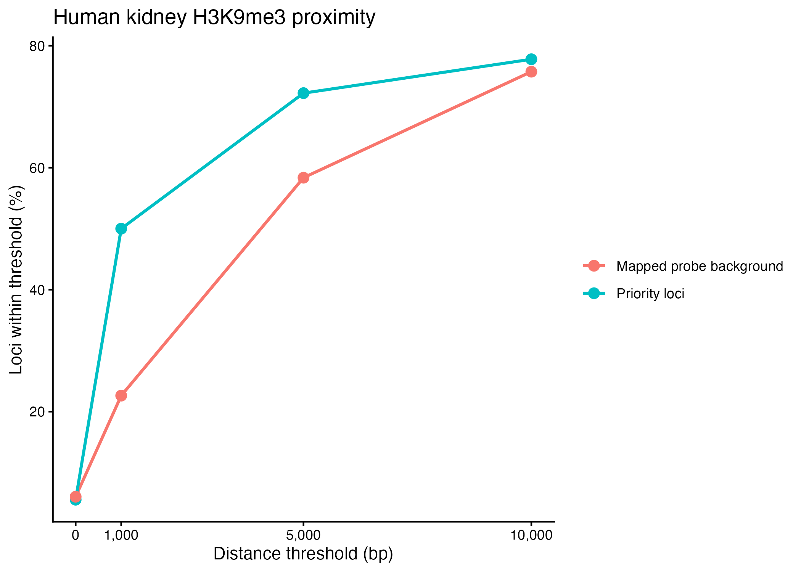

# TRIM28-linked chromatin context of divergent DNA methylation states

This project investigates whether the divergent DNA methylation states observed in **Trim28+/D9 Light and Heavy mice** are associated with distinct chromatin environments, with a particular focus on **TRIM28-associated H3K9me3**.

The analysis was designed to move beyond a simple list of differentially methylated loci. Starting from the published mouse methylation signal, I asked whether the two methylation directions occupy different chromatin states, whether a mechanistically focused subset can be linked to TRIM28/H3K9me3, and whether those loci retain informative chromatin context after mapping to the human genome.

**Analysis logic:**  
**mouse methylation → chromatin context → TRIM28/H3K9me3 priority loci → mouse-to-human mapping → human kidney chromatin context**

---

## 1. Mouse methylation: establishing the starting signal

The methylation dataset contained **24 Trim28+/D9 mouse samples**, including **9 Light** and **15 Heavy** samples. After filtering for complete measurements, **250,882 probes** were retained.

As an initial quality-control step, principal component analysis was used to examine the overall methylation structure across samples.

<p align="center">
  
</p>

<p align="center"><b>Figure 1. Mouse methylation PCA.</b></p>

The PCA was used to inspect sample-level structure before locus-level testing. The downstream analysis identified **1,159 sensitivity DMLs** and recovered the **1,133 published DMLs** used as the main reference set for the chromatin analyses.

Among the 1,133 published DMLs:

- **960** showed higher methylation in Heavy mice
- **173** showed higher methylation in Light mice

This directional split was important because the next step was not simply to ask where DMLs occurred, but whether **Heavy-up and Light-up loci were embedded in different chromatin environments**.

---

## 2. Heavy-up DMLs are preferentially associated with repressive chromatin

The 1,133 published DMLs were intersected with mouse chromatin annotations, including **H3K9me3**, **H3K27me3**, a combined **TRIM28/H3K9me3** annotation, and heterochromatin-related states.

<p align="center">
  
</p>

<p align="center"><b>Figure 2. Chromatin context of Heavy-up and Light-up DMLs.</b></p>

The two methylation directions showed clearly different chromatin profiles.

For **H3K9me3**, **11.0% of Heavy-up DMLs** overlapped the mark compared with **3.5% of Light-up DMLs**. This corresponded to an odds ratio of **3.45** and remained significant after multiple-testing correction (**FDR = 0.0032**).

A similar pattern was observed for **H3K27me3**: **6.7% of Heavy-up loci** overlapped H3K27me3 compared with **1.2% of Light-up loci** (**OR = 6.10; FDR = 0.0037**).

Most importantly for the mechanistic question, **31 Heavy-up DMLs** fell within the combined **TRIM28/H3K9me3** category, while **none of the Light-up DMLs** did (**FDR = 0.0118**).

The pattern therefore suggested that the Heavy-up methylation state was not randomly distributed across the genome. Instead, a subset of Heavy-up loci was concentrated in a chromatin environment consistent with **TRIM28-linked repression**.

---

## 3. Defining a mechanistically focused priority set

The chromatin comparison provided a natural way to narrow the analysis.

Priority loci were defined by the intersection of three features:

**higher methylation in Heavy mice + TRIM28 association + H3K9me3 association**

This produced a **31-locus mouse priority set**.

Rather than carrying all 1,133 DMLs into the cross-species analysis, this smaller set was used because it was directly connected to the proposed chromatin mechanism.

The 31 loci were then converted from **mm10 to hg38** coordinates using liftOver.

<p align="center">
  
</p>

<p align="center"><b>Figure 3. Mouse-to-human liftOver status of the 31 priority loci.</b></p>

Of the 31 mouse priority loci:

- **18 mapped uniquely to hg38**
- **13 were unmapped**

The **18 uniquely mapped loci** formed the human-facing subset used in the next stage of the project.

This step is important to the interpretation of the human analysis: the human component was **not** a genome-wide scan. It was a targeted follow-up of mouse loci selected because of their methylation direction and TRIM28/H3K9me3 context.

---

## 4. Human kidney multiome data: placing the mapped loci in a cellular context

To examine the accessibility landscape surrounding the mapped loci, a human kidney multiome dataset was used as a pilot chromatin-context resource.

<p align="center">
  
</p>

<p align="center"><b>Figure 4. Human kidney UMAP used in the multiome pilot analysis.</b></p>

The UMAP provides the cellular context of the kidney multiome dataset used for the ATAC-based analysis. The purpose of this step was not to perform a new differential cell-state analysis. Instead, the multiome data were used to determine whether the **18 mapped priority loci** intersected regions of accessible chromatin in human kidney cells.

This allowed the mouse-derived loci to be evaluated in a cell-resolved human chromatin landscape.

---

## 5. The mapped priority loci occupy mixed human chromatin states

The 18 mapped loci were evaluated using two complementary chromatin features:

- **ATAC-seq peak overlap**, representing accessible chromatin
- **H3K9me3 proximity**, representing a repressive chromatin environment

The two signals were integrated at the locus level.

<p align="center">
  
</p>

<p align="center"><b>Figure 5. Integrated chromatin context of the 18 human-mapped priority loci.</b></p>

The mapped loci were distributed across four categories:

- **2 loci** showed both ATAC overlap and H3K9me3 proximity
- **6 loci** overlapped an ATAC peak only
- **7 loci** were near H3K9me3 only
- **3 loci** showed neither feature

In total, **8 of 18 loci** overlapped accessible chromatin, while **9 of 18 loci** were located within **1 kb of an H3K9me3 region**.

The result therefore did not point to one uniform human chromatin state. Instead, the priority loci mapped to a mixture of accessible, repressive, and mixed regulatory environments.

That heterogeneity is biologically useful: it suggests that the mouse TRIM28/H3K9me3-associated methylation signature may involve loci with different regulatory configurations rather than a single chromatin class.

---

## 6. H3K9me3 is enriched near the human-mapped priority loci at a local scale

To test whether the apparent H3K9me3 association was greater than expected, the 18 mapped priority loci were compared with a background set of mapped MM285 probes.

<p align="center">
  
</p>

<p align="center"><b>Figure 6. H3K9me3 enrichment around human-mapped priority loci.</b></p>

The strongest difference was observed at a **1 kb distance threshold**.

At this local scale:

- **9 of 18 priority loci (50.0%)** were near H3K9me3
- **22.6% of background loci** were near H3K9me3
- **Odds ratio = 3.42**
- **FDR = 0.0399**

The enrichment was not significant at the broader 5 kb or 10 kb windows, indicating that the strongest signal was **local rather than broadly regional**.

Because the human H3K9me3 dataset represents a limited biological source, this analysis is interpreted as **supportive cross-species evidence**, not as population-level validation.

---

## Main interpretation

The central result of the project is not simply that Light and Heavy mice differ in DNA methylation.

The more informative finding is that the two methylation directions are associated with **different chromatin environments**.

Heavy-up DMLs showed increased association with **H3K9me3** and **H3K27me3**, and a specific subset of **31 Heavy-up loci** occurred within a combined **TRIM28/H3K9me3** context. That observation provided a mechanistically motivated locus set for cross-species follow-up.

Eighteen of those loci could be uniquely mapped to the human genome. In human kidney chromatin data, the mapped loci occupied a mixture of accessible and repressive states, and the priority set showed a significant local enrichment near **H3K9me3 at 1 kb** relative to the mapped-probe background.

Taken together, these results are consistent with a model in which the divergent methylation states are connected to **chromatin organization**, with **TRIM28-associated repressive chromatin** representing a plausible component of the Heavy-up state.

The human analysis is exploratory and does not establish causality. Its value is that it narrows the original methylation observation into a concrete mechanistic direction that can be tested with larger, multi-donor, cell-type-resolved chromatin and methylation datasets.

---

## Key results at a glance

| Analysis step | Main result |
|---|---|
| Mouse samples | 9 Light, 15 Heavy |
| Complete methylation probes | 250,882 |
| Sensitivity DMLs | 1,159 |
| Published DMLs recovered | 1,133 |
| Heavy-up / Light-up DMLs | 960 / 173 |
| H3K9me3 overlap | 11.0% Heavy-up vs 3.5% Light-up |
| H3K27me3 overlap | 6.7% Heavy-up vs 1.2% Light-up |
| TRIM28/H3K9me3 priority loci | 31 Heavy-up loci |
| Unique mouse-to-human mappings | 18 |
| Human ATAC overlap | 8/18 |
| Human loci near H3K9me3 (≤1 kb) | 9/18 |
| Integrated human context | 2 both, 6 ATAC-only, 7 H3K9me3-only, 3 neither |
| H3K9me3 enrichment at 1 kb | OR 3.42; FDR 0.0399 |

---

## Data sources

The project uses the following main inputs:

- **GSE229030** — mouse DNA methylation data used for the Light-versus-Heavy analysis
- **Published supplementary source-data workbook** — used to recover the published DML set used in downstream analyses
- **MM285 probe and chromatin annotation resources** — used to connect methylation probes with genomic and chromatin features
- **GSE220251 human kidney multiome data** — used for the pilot ATAC-based chromatin accessibility analysis
- **Human kidney H3K9me3 data** — used to examine repressive chromatin context around the mapped loci
- **UCSC liftOver chain files** — used for coordinate conversion between genome assemblies

Large public source files are not duplicated unnecessarily in the repository. Where possible, the analysis scripts retrieve or regenerate required resources.

---

## Analysis workflow

The project is organized as a sequential R workflow:

```text
Scripts/
├── 00_setup_and_checks.R
├── 01_mouse_methylation_qc_dml.R
├── 02_mouse_chromatin_context.R
├── 03_priority_loci_liftover.R
├── 04_human_multiome_pilot.R
├── 05_human_kidney_h3k9me3.R
├── 06_integrate_and_figures.R
└── 99_session_info.R
```

The analytical logic is:

```text
Mouse methylation data
        ↓
QC and Light-vs-Heavy methylation analysis
        ↓
1,133 published DMLs recovered
        ↓
Heavy-up vs Light-up chromatin comparison
        ↓
31 Heavy-up TRIM28/H3K9me3 priority loci
        ↓
mm10 → hg38 liftOver
        ↓
18 uniquely mapped human loci
        ↓
Human kidney ATAC + H3K9me3 context
        ↓
Integrated cross-species interpretation
```

---

## Repository structure

```text
.
├── Data/
│   ├── raw/
│   ├── processed/
│   └── reference/
├── Figures/
├── Results/
├── Scripts/
├── README.md
└── .gitignore
```

`Figures/` contains the main and supporting visual outputs shown directly in this README.

`Results/` contains the numerical outputs underlying the figures and summaries.

`Scripts/` contains the analysis pipeline in execution order.

The R environment and package versions used for the analysis are recorded in:

```text
Results/session_info/session_info.txt
```

---

## Reproducibility

Run the scripts from the repository root in numerical order:

```r
source("Scripts/00_setup_and_checks.R")
source("Scripts/01_mouse_methylation_qc_dml.R")
source("Scripts/02_mouse_chromatin_context.R")
source("Scripts/03_priority_loci_liftover.R")
source("Scripts/04_human_multiome_pilot.R")
source("Scripts/05_human_kidney_h3k9me3.R")
source("Scripts/06_integrate_and_figures.R")
source("Scripts/99_session_info.R")
```

The human multiome analysis should be interpreted as a **pilot chromatin-context analysis**, rather than as a multi-sample differential accessibility study.

---

## Use of AI

The research question, biological rationale, analysis strategy, and interpretation of the results were developed by me. I used an AI assistant as a supporting tool to help reorganize and refine parts of the R code, troubleshoot implementation issues, improve figure formatting, standardize the repository structure, and proofread the README.

All analyses and figures reported in this repository were generated by running the scripts on the mouse methylation and human kidney datasets described above, and the numerical results were checked against the corresponding output files.

---

## Overall

The analysis identified a subset of Heavy-up methylation loci associated with TRIM28/H3K9me3 chromatin context. A portion of these loci could be mapped to the human genome, where they showed a mixture of accessible and H3K9me3-associated chromatin states. These findings provide a focused basis for further testing of a possible link between TRIM28-associated chromatin organization and divergent DNA methylation states.
